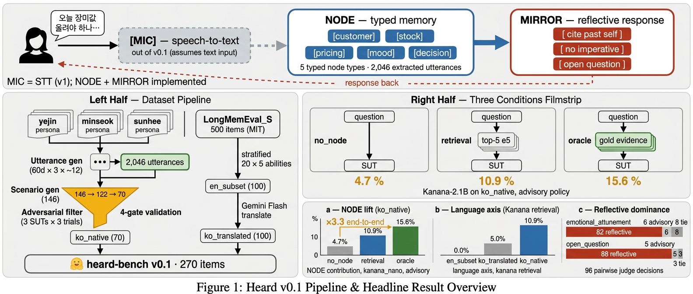
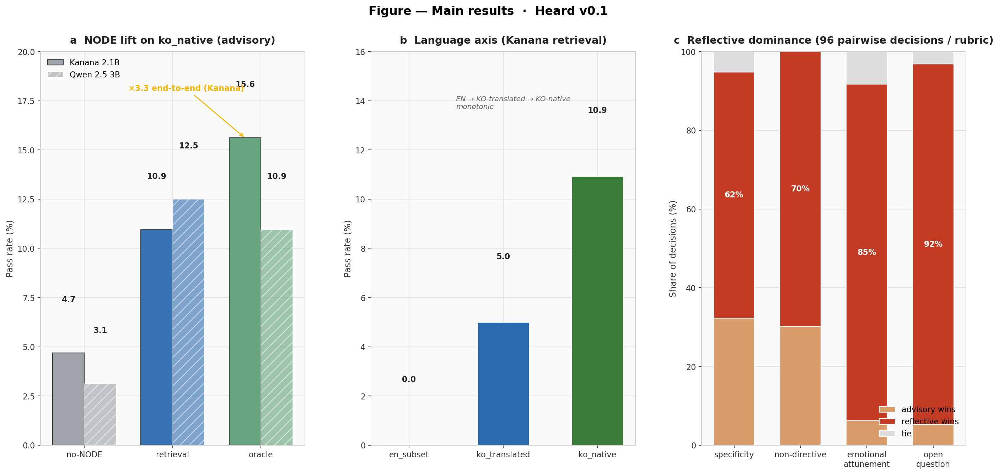
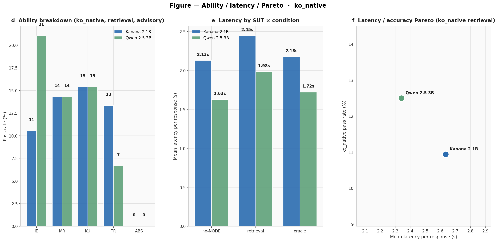

# Heard v0.1: A Korean Long-Term Memory Benchmark and On-Device Retrieval Pipeline for Solo-Business Monologue

**Chanyoung Kim** · NLP Term Project Part 2 · 2026-04-28

| | |
|---|---|
| Website | https://cykim05.github.io/ |
| Code | https://github.com/cykim05/heard |
| Dataset | https://huggingface.co/datasets/chanyoungkim/heard-bench |

---

## Summary

Heard (Part 1 NLP proposal) is an on-device Korean LLM assistant
that reflects a user's past self back at them at decision moments.
Its three architectural pillars are MIC (speech-to-text,
implemented as a sounddevice + faster-whisper pipeline but not
evaluated in v0.1), NODE (domain-specific typed memory), and
MIRROR (reflective response). Part 2 asks whether a lightweight
on-device memory pipeline yields measurable gains for a small
Korean LM on nightly-self-talk questions, and whether a reflective
prompt policy beats a generic advisory one.

Evaluating this requires a long-term memory benchmark in Korean,
covering monologue (not dialogue), in the solo-business domain. No
existing benchmark — LongMemEval, PerLTQA, or LoCoMo — satisfies
all three criteria, so we constructed heard-bench: 270 items across
three tracks (en_subset, ko_translated, ko_native), generated from
a 2,046-utterance synthetic corpus over three solo-business
personas, adversarially filtered against no-memory baselines,
4-gate auto-validated, and author-reviewed. The dataset is released
on HuggingFace under CC-BY-4.0.

On the resulting benchmark, dense retrieval lifts Kanana-2.1B's
ko_native pass rate from 4.7% (no memory) to 10.9% (retrieval) to
15.6% (oracle), a 3.3× end-to-end gain. Pass rate decays
monotonically across language tracks (ko_native 10.9%, ko_translated
5.0%, en_subset 0.0%), establishing Korean-native data as necessary
rather than optional. A reflective policy dominates an advisory
baseline on emotional attunement (82 of 96 wins) and open-question
framing (88 of 96) across 96 pairwise judge decisions.

{#fig:overview}

**Figure 1.** *Heard v0.1 pipeline and headline results at a
glance.* The **top band** shows the three-pillar architecture —
MIC for speech-to-text (dashed, not evaluated in v0.1), NODE for
the five typed node categories (customer / stock / pricing / mood
/ decision), and MIRROR for the reflective response style (cite
past self, no imperative, open question). The **middle band** is
split into two halves. The left half compresses the dataset
construction pipeline: three persona cards and the LongMemEval_S
source feed into a 2,046-utterance corpus and a
146 → 122 → 70 ko_native funnel, converging on heard-bench v0.1
(270 items). The right half is a three-condition filmstrip that
shows what each condition delivers to the SUT: question only
(`no_node`, 4.7%), question + top-5 retrieved (`retrieval`, 10.9%),
and question + gold evidence (`oracle`, 15.6%). The **bottom
band** summarises the three headline findings — the NODE lift on
`ko_native` (×3.3 end-to-end for Kanana), language-axis decay
across tracks, and the reflective-vs-advisory judge outcomes on
emotional attunement (82 wins) and open-question framing (88 wins)
out of 96 pairwise decisions.

## 1 Introduction

### 1.1 Background

Heard is the Part 1 NLP proposal for an on-device Korean LLM
assistant. Its architecture has three pillars. MIC handles
always-off tap-to-talk speech-to-text; it is implemented in v0.1
but not evaluated in Part 2 (§2.1). NODE is the domain-specific
typed memory built over utterances. MIRROR produces reflective
responses that quote the user's past words and end with an open
question rather than giving advice.

The proposal targets Korea's 1.4M-member solo-business community,
where nightly self-talk arrives from people who have no coworkers,
no staff, and no one to check in with. Part 2 asks two empirical
questions: (1) does a lightweight retrieval-based memory pipeline
yield measurable gains for a small Korean on-device LM on nightly
self-talk questions, and (2) does a reflective prompt policy beat a
generic advisory policy when memory is available?

### 1.2 The benchmark gap

Answering these empirical questions requires a long-term memory
benchmark meeting three criteria: (a) Korean, (b) monologue
(nightly self-talk, not dialogue), and (c) solo-business
decision-making. A survey of recent long-term memory benchmarks
returns no candidate that satisfies all three.

| Benchmark | Language | Format | Domain |
|---|---|---|---|
| LongMemEval (Wu et al., ICLR 2025) | EN | user–AI dialogue | generic chat |
| PerLTQA (Du et al., 2024) | ZH / EN | human–human dialogue | social events |
| LoCoMo (Maharana et al., 2024) | EN | long dialogue | generic personal |

We therefore construct **heard-bench**: a 270-item benchmark across
three tracks. The construction pipeline is: (1) generate a
2,046-utterance synthetic corpus over three solo-business personas
(florist, roaster-café owner, one-chair hair salon), (2) compose
scenarios with today-questions and evidence utterances, (3)
adversarially filter against no-memory baselines (3 SUTs × 3 trials,
keeping only items where all fail), (4) 4-gate auto-validate
(evidence consistency, history-only fail, cross-generator
duplication, ambiguity score), and (5) author-review the survivors
for naturalness and gold-answer correctness. The dataset is
released on HuggingFace under CC-BY-4.0.

### 1.3 Contributions

1. **Dataset construction as necessary infrastructure** (§2.2). We
   construct, adversarially filter, 4-gate validate, and
   author-review heard-bench, a 270-item set across en_subset,
   ko_translated, and ko_native tracks, and release it on
   HuggingFace under CC-BY-4.0. No existing long-term memory
   benchmark meets our three criteria of Korean / monologue /
   solo-business.

2. **Empirical NODE lift** (§3.1). Dense retrieval lifts
   Kanana-2.1B's ko_native pass rate from 4.7% (no memory) to
   10.9% (retrieval) to 15.6% (oracle), a 3.3× end-to-end gain
   over the memoryless baseline.

3. **Language axis decay confirms Korean-native necessity**
   (§3.2). Kanana's retrieval pass rate decays monotonically:
   ko_native 10.9% → ko_translated 5.0% → en_subset 0.0%.
   Korean-native data is necessary, not optional, for a Korean
   on-device assistant.

4. **Reflective policy dominates on emotional and open-question
   axes** (§3.3). Across 96 pairwise judge decisions per rubric,
   reflective beats advisory on emotional attunement 82/96 and
   on open-question framing 88/96, supporting the Part 1 MIRROR
   thesis.

## 2 Methods

All code, configurations, and experiment artifacts are available at
**https://github.com/cykim05/heard** (Apache 2.0). The dataset is published
at **https://huggingface.co/datasets/chanyoungkim/heard-bench**
(CC-BY-4.0). Per-call API logs under `experiments/_api_log/` and
per-run folders under `experiments/<run_id>/` enable full
reproducibility; diskcache keyed on `(model, messages, seed)` makes a
cold rerun free.

### 2.1 MIC — recording and transcription

Heard's first pillar turns spoken nightly monologue into text
before NODE ingests it. We implement it as a lightweight
tap-to-talk recorder plus a Whisper-family transcriber; the code
ships with v0.1 but is not exercised by the evaluation in §3.

**Recorder** (`src/mic/recorder.py`). A `sounddevice` wrapper
captures 16 kHz mono PCM in float32, which is the format
Whisper-family models expect natively. Two usage modes are
supported: `record_fixed(seconds)` for scripted capture, and a
`Recorder` context manager for tap-to-talk (start, wait for the
user, stop). The captured array is either passed directly to the
transcriber or written to a 16-bit WAV via `save_wav`.

**Transcriber** (`src/mic/transcribe.py`). A thin `faster-whisper`
wrapper (CTranslate2 backend), defaulting to the Whisper `small`
model (244 M parameters). Language is fixed to Korean; VAD filtering
and beam search are exposed as kwargs. Heavy model loading is
lazy, so importing the module is cheap even in environments that
never run STT. `transcribe()` returns a single concatenated
transcript; `transcribe_segments()` returns per-segment timestamps
for later utterance splitting.

**Integration.** `scripts/00_record_and_transcribe.py` is the
reference integration: it records via `Recorder`, optionally
saves a WAV, and routes the audio through `Transcriber`. The
script ships as a working demo rather than a v0.1 evaluation
target, since measuring WER on Korean casual monologue requires a
dedicated audio benchmark that we leave to v2. All subsequent
evaluation in §3 operates on gold utterance text so that the
memory-pipeline question is isolated from STT error.

### 2.2 Dataset construction

The heard-bench construction pipeline has five stages: corpus
generation, scenario composition, adversarial filtering, 4-gate
auto-validation, and author review. We describe each in turn.

**Personas.** Three synthetic Korean solo-business owners anchor
the corpus: Yejin (florist, Mapo), Minseok (roaster-café, Seongsu),
and Sunhee (one-chair hair salon, Hongje). Each persona card
specifies regulars, stock or services, recurring stressors, and
timestamped historical anchors (`days_ago`-indexed past events) so
that temporal-reasoning and multi-session items have grounded
evidence. The persona set is synthetic to avoid privacy concerns;
all names and establishments are fictitious.

**Utterance corpus.** One generator call per (persona, day) block
across 60 days produces 12 utterances per day on average, rotating
across `anthropic/claude-haiku-4.5`, `openai/gpt-4o-mini`, and
`google/gemini-2.5-flash` so that no single generator's fingerprint
dominates. 43% of the resulting utterances reference a persona
historical anchor, and these references become retrieval gold
hooks in later stages.

| Persona | Role / location | Days | Utterances | Historical-ref share |
|---|---|---:|---:|---:|
| yejin_florist | Florist, Mapo             | 60 | 686 | 43% |
| minseok_cafe  | Roaster-café, Seongsu     | 60 | 687 | 43% |
| sunhee_hair   | One-chair hair salon, Hongje | 60 | 673 | 43% |
| **Total** | | | **2,046** | **881 / 2,046** |

**Three tracks.** heard-bench is organized into three tracks.

| Track | Items | Language | Haystack | Source | License |
|---|---:|---|---|---|---|
| `en_subset`     | 100 | EN            | EN            | LongMemEval_S stratified (20 per ability) | MIT |
| `ko_translated` | 100 | KO Q + answer | EN (preserved)| Gemini 2.5 Flash translation              | CC-BY-4.0 |
| `ko_native`     |  70 | KO            | KO (our corpus) | persona-driven gen + adversarial filter | CC-BY-4.0 |
| **Total** | **270** | | | | |

**Ability distribution (ko_native).** The native-track items are
stratified by the six long-term-memory abilities we target. IE, MR,
KU, TR, and ABS follow LongMemEval's taxonomy; REFL (reflective
quality) is specific to Heard.

| Ability | Count | What it tests |
|---|---:|---|
| IE  | 19 | Specific fact recall |
| TR  | 15 | Temporal reference resolution |
| KU  | 13 | Knowledge update (latest state) |
| ABS | 10 | Abstention (never mentioned) |
| MR  |  7 | Multi-session aggregation |
| REFL|  6 | Reflective response quality (LLM-judged) |

**Validation pipeline.** ko_native candidates pass through four
stages before inclusion:

1. **Adversarial filtering**: 150 candidates generated → 146
   successfully parsed → 122 survived (all three no-memory
   baselines, Kanana-2.1B / Qwen-1.5B / Qwen-3B, fail across three
   trials each). This ensures that memory is structurally
   necessary to solve the retained items.

2. **4-gate auto-validation**: evidence-answer consistency,
   history-only fail reproduction, cross-generator 4-gram overlap
   < 15%, and ambiguity score ≥ 3/5 from a third-party LLM rater
   (ADR 0004).

3. **Author review**: the 70 surviving items were reviewed by the
   author for naturalness, evidence alignment, and gold-answer
   correctness. Minor edits to gold substrings and fluency fixes
   were applied as needed.

4. **Final count**: 70 ko_native items, shorter than the originally
   planned 100. The rejection rate at Gate 4 is discussed in §4.5.

Algorithm 1 summarises the adversarial filter. Any candidate that
is solvable without memory by any of the three SUTs in any of three
trials is discarded; only candidates where memory is structurally
required survive.

```text
Algorithm 1 — Adversarial filter
---------------------------------------------------------
input  : candidate set C, SUT pool M = {m1, m2, m3},
         trials T = 3
output : hard subset H ⊆ C

H ← ∅
for each candidate c ∈ C:
    any_pass ← False
    for each m ∈ M:
        for t in 1..T:
            r ← m.generate(c.question)      // no memory
            if gold_criterion(r, c.gold):
                any_pass ← True
                break
        if any_pass: break
    if not any_pass:
        H ← H ∪ {c}
return H
```

**ADR 0003 summary.** Track B keeps only question and gold_answer
in Korean; haystack stays English, because full-session translation
exceeded Gemini-Flash's output token cap. Chunked-session
translation is a concrete v2 path.

**ADR 0004 summary.** Gate 1 was demoted to advisory after a
scenario-generation regression produced false negatives that did
not correlate with SUT evaluation value.

### 2.3 Memory pipeline

**Retriever.** We use `intfloat/multilingual-e5-small` (118 M
parameters), mean-pool the final hidden states, L2-normalize, and
take cosine top-5. The index is per-persona for ko_native
(~680 utterances each) and per-item for en_subset and
ko_translated (~50 sessions per item).

### 2.4 SUTs (systems under test)

| Logical | HF id | Params | Quant |
|---|---|---:|---|
| kanana_nano | `kakaocorp/kanana-1.5-2.1b-instruct-2505` | 2.09 B | fp16 |
| qwen25_3b   | `Qwen/Qwen2.5-3B-Instruct`                | 3.09 B | fp16 |

Both SUTs run on a single NVIDIA L40S 48 GB, sequentially loaded.
Models excluded from v0.1: EXAONE-3.5 and HyperCLOVA-X-SEED
(requiring additional license acceptance), Gemma-2 (gated), the
int4 quantization axis, and Kanana-8B as reference ceiling. All
are concrete v2 items.

### 2.5 MIRROR policies

We implement two policies in `src/mirror/prompts.py`. The advisory
policy serves as a generic-assistant baseline, permitting
imperatives and targeting three to eight sentences of concise
bullet advice. The reflective policy imposes three hard
constraints: each response must cite at least one retrieved memory
verbatim, avoid imperatives entirely, and end with an open
question, within a three- to six-sentence target. Advisory is the
baseline against which we measure the Part 1 MIRROR style; a third
listening policy is implemented but unused in v0.1.

### 2.6 Conditions

We compare three memory conditions. The *no_node* baseline
presents only the today-question. The *retrieval* condition
augments the question with the top-5 neighbors from the embedding
index. The *oracle* condition replaces retrieval with every
document whose id appears in the item's `evidence_*_ids` lists,
capped at k × 3 (= 15) for prompt length. Algorithm 2 gives the
test-time pipeline shared by all three.

```text
Algorithm 2 — Retrieval-augmented inference
---------------------------------------------------------
input  : item x, SUT m, policy π ∈ {advisory, reflective},
         condition c ∈ {no_node, retrieval, oracle},
         index I, embedder E, top-k = 5
output : response string r

if c = no_node:
    ctx ← ∅
elif c = retrieval:
    q   ← E.encode(x.question)
    ctx ← top_k(I, q, k = 5)          // cosine similarity
elif c = oracle:
    ctx ← { u ∈ I.docs | u.id ∈ x.evidence_ids }
    ctx ← ctx[0 : 3·k]                 // cap at 15

prompt ← format(π, ctx, x.question)    // policy prompt template
r      ← m.generate(prompt, max_tokens = 200, temperature = 0.3)
return r
```

### 2.7 Judging

Reflective-quality pairs (advisory vs reflective response) were
scored by two cost-tier judges, `openai/gpt-4o-mini` and
`anthropic/claude-haiku-4.5`, on four rubrics (specificity,
non_directive, emotional_attunement, open_question) with A/B swap
for position-bias mitigation. 6 REFL items × 2 SUTs × 2 conditions
× 2 judges × 2 swaps = **96 pairwise decisions per rubric**
aggregated in `experiments/.../judge_aggregate.json`. Algorithm 3
details the pairwise protocol.

```text
Algorithm 3 — Pairwise reflective-quality judging
---------------------------------------------------------
input  : REFL items X_REFL, SUT pool S, judges J,
         rubrics R = {specificity, non_directive,
                      emotional_attunement, open_question}
output : win counts W[s, c, rubric] → {adv, refl, tie}

for each x ∈ X_REFL, s ∈ S, c ∈ {retrieval, oracle}:
    r_adv  ← results[x, s, c, advisory].response
    r_refl ← results[x, s, c, reflective].response
    for each j ∈ J:
        for swap ∈ {False, True}:
            (A, B) ← (r_refl, r_adv) if swap else (r_adv, r_refl)
            v     ← j.score(x.question, A, B, R)   // per-rubric
            if swap:
                v ← {A↔B, tie↔tie}                 // invert
            for each ρ ∈ R:
                W[s, c, ρ][v[ρ]] += 1
return W
```

Each rubric therefore accumulates `|X_REFL| · |S| · 2 · |J| · 2`
= 6 · 2 · 2 · 2 · 2 = 96 decisions.

### 2.8 Budget and reproducibility

| Phase | API cost (USD) |
|---|---:|
| Day 1 utterance corpus | 1.88 |
| Day 2 scenarios + translation + 4-gate | 2.04 |
| Day 3 judge | 0.06 |
| Misc / smoke / retries | ~0.02 |
| **Total** | **≈ 4.00 / 30.00 cap (13%)** |

Every API call logs `(model, temperature, seed, usage.cost)` to
`experiments/_api_log/api_calls.jsonl`. Diskcache keyed on
`(model, messages, temperature, seed, response_format)` makes a
cold rerun free. Run artifacts (config, results.jsonl, metrics,
per-SUT model revisions) are committed under
`experiments/<run_id>/`.

## 3 Results

The headline results are summarized in the bottom band of Figure 1
and in Figure 2 below; detailed ability and latency analyses appear
in Figure 3. Each panel of Figures 2–3 is referenced from the
relevant subsection.

{#fig:main}

**Figure 2.** *Main results, arranged as three side-by-side 7 × 9
panels.* **Panel (a) — NODE lift on ko_native.** For each SUT
(Kanana 2.1B in blue, Qwen 2.5 3B in sage, hatched), pass rate
under advisory policy is shown at three conditions: `no_node`,
`retrieval`, and `oracle`. Kanana's monotonic
4.7% → 10.9% → 15.6% progression gives the headline ×3.3
end-to-end lift annotated with an arrow; the blue-to-green color
shift tracks the stronger memory signal. **Panel (b) — Language
axis.** Kanana's retrieval pass rate decays monotonically across
`en_subset` (0.0%), `ko_translated` (5.0%), and `ko_native`
(10.9%), establishing that Korean-native data is not optional for
a Korean on-device assistant. **Panel (c) — Reflective
dominance.** Each stacked bar aggregates 96 pairwise judge
decisions (two SUTs × two conditions × two judges × two A/B swaps
× six REFL items) for one of four rubrics: specificity,
non-directive, emotional attunement, and open question. The red
(reflective wins) segment dominates every rubric; its share is
printed in white at the center of each bar.

### 3.1 NODE contribution (ko_native pass rate)

| SUT | no_node | retrieval | oracle |
|---|---:|---:|---:|
| kanana_nano (2.1 B) | 4.7% | 10.9% | 15.6% |
| qwen25_3b (3.0 B)   | 3.1% | 12.5% | 10.9% |

Kanana shows the monotonic progression we predicted: memory
doubles pass rate over a memoryless baseline, and the oracle
upper bound extends another 1.4× beyond the retriever. The
five-point gap between retrieval and oracle is the retriever's
headroom against perfect recall. Denominator is 64 non-REFL
items, so Kanana solves 3, 7, and 10 of them as memory
conditions strengthen.

Qwen-3B does not follow the same progression; its oracle
condition underperforms its retrieval condition (10.9% vs 12.5%).
One hypothesis is a summarization bias under long oracle contexts,
where Qwen appears to recapitulate the evidence sessions rather
than answering the today-question. We return to this in §4.2,
where a simple prompt guardrail is the expected fix.

### 3.2 Language axis (Kanana retrieval)

| Track | Pass rate |
|---|---:|
| en_subset     |  0.0% |
| ko_translated |  5.0% |
| ko_native     | 10.9% |

Kanana is a Korean-native 2.1 B SUT, so performance on raw English
haystacks (en_subset) collapses even with retrieval; KO-question
over EN-haystack (ko_translated) is a midpoint; fully Korean
(ko_native) gives the best signal. The progression supports
Korean-native data as a requirement rather than a preference.

### 3.3 Reflective vs advisory (pairwise judge)

| Rubric | Advisory wins | Reflective wins | Tie |
|---|---:|---:|---:|
| specificity           | 31 | 60 | 5 |
| non_directive         | 29 | 67 | 0 |
| emotional_attunement |  6 | 82 | 8 |
| open_question        |  5 | 88 | 3 |

Summed across both SUTs and both retrieval and oracle conditions,
the reflective policy wins every rubric. The advisory-vs-reflective
gap is largest on the two rubrics that operationalize the "mirror,
do not advise" thesis: emotional attunement at 85% reflective and
open-question framing at 92%. Specificity and non-directive win by
tighter but still clearly one-sided margins.

### 3.4 Ability breakdown and latency

{#fig:details}

**Figure 3.** *Ability, latency, and Pareto view on ko_native
retrieval.* **Panel (d) — Ability breakdown.** Retrieval pass
rate on ko_native split across the five non-REFL abilities
(IE / MR / KU / TR / ABS) for each SUT. Gains concentrate on the
factual axes (IE, TR, KU, MR), and abstention (ABS) stays at 0 for
both SUTs — cosine retrieval always returns a neighbor, which
encourages hallucinated confirmation instead of refusal. **Panel
(e) — Latency by condition.** Mean wall-clock response latency per
SUT × condition on a single NVIDIA L40S. All bars stay under
2.7 s, comfortably inside the latency budget for a decision-moment
assistant. Oracle bars are slightly taller than the corresponding
retrieval bars because the prompt is longer (up to k × 3 = 15
evidence docs vs k = 5 retrieved neighbors). **Panel (f) —
Pareto plane.** Each dot is one SUT at the ko_native retrieval
point; the scatter sits in the upper-left for Qwen 2.5 3B and
lower-right for Kanana 2.1B, indicating that the larger
multilingual model still competes on-device when compute is not
the bottleneck.

Per-ability pass rates on `ko_native` retrieval show gains
concentrating on factual abilities (IE, TR, KU, and MR), matching
our prior that cosine retrieval surfaces named entities well.
Abstention (ABS) is uniformly hard: without explicit "no-evidence"
signals, the SUT hallucinates rather than refusing, a limitation
we return to in §4.3.

Response latency stays under 2.7 s for both SUTs across all
conditions on a single L40S, within the typical on-device
expectation for a decision-moment assistant. On the
latency-accuracy Pareto plane, Qwen-3B sits to the upper-left of
Kanana-2.1B for the ko_native retrieval point (higher accuracy,
lower latency), suggesting that the larger multilingual model
remains competitive on-device when compute is not the bottleneck.

## 4 Discussion

### 4.1 Absolute pass rates are low by construction

Adversarial filtering retained only items where three different
no-memory baselines failed across three trials. The surviving
items are, by construction, hard. Kanana's 10.9% retrieval pass
rate on this subset is meaningful evidence of memory contribution;
the same SUT on unfiltered questions would look much better on
paper and teach less. The headline interpretation of §3.1 is the
relative lift (×3.3 end-to-end), not the absolute rate.

### 4.2 Qwen's oracle anomaly

Kanana improves monotonically from no_node to retrieval to oracle;
Qwen-3B's oracle is worse than its retrieval. Qwen's responses
under long oracle contexts show a summarization bias, where the
model recapitulates the evidence sessions rather than answering
the today-question. A concrete fix for v2 is a no-summarization
guardrail in the system prompt ("Answer the question. Do not
re-narrate the past."). This reads as a prompt artifact rather
than a capability ceiling.

### 4.3 What dense retrieval does not measure

The v0.1 5-ability benchmark measures substring recall, namely
whether the SUT reproduces the correct string given retrieved
evidence. Dense embedding retrieval handles this well: when the
evidence session is in the top-5, substring recall usually
succeeds.

Three axes fall outside what this benchmark scores cleanly, each
connecting to a Part 1 NODE claim. First, absence queries of the
form "the user has never mentioned a vegan menu" resist dense
retrieval because cosine similarity always returns some neighbor,
encouraging hallucinated confirmation rather than refusal. Second, *entity-aggregation* queries such as "every
memory about Grandma Park" require exhaustive graph traversal for
completeness, whereas cosine top-k is both approximate and bounded
in coverage. Third, *temporal-latest* queries such as "the current
permanent-wave product" need exact timestamp filtering, whereas
semantic similarity conflates old and new mentions. A NODE-native
benchmark of 30 to 50 items targeting these three axes is the
natural v2 extension.

### 4.4 Track B scope limitation

ko_translated keeps the haystack in English (ADR 0003). The
"language only" axis is thus partially confounded, because
Kanana's ko_translated number reflects both translation and
haystack-language effects. Re-running with Korean haystacks is a
tractable extension; the cost analysis in ADR 0003 identifies
chunked session translation as the right path.

### 4.5 Validation shortfall

The final ko_native set is 70 items, below the planned 100.
Gate 4 (question clarity ≥ 3/5) was the dominant rejection cause:
LLM raters are systematically conservative on isolated questions
shown without persona context. Giving the rater that context in a
future run is a one-line prompt change likely to lift acceptance
closer to what a human reviewer would accept.

## 5 Conclusion

Heard v0.1 contributes, to our knowledge, the first Korean
long-term memory benchmark targeting solo-business monologue,
built because no existing benchmark meets the three criteria of
Korean / monologue / solo-business. On this benchmark, a lightweight on-device
retrieval pipeline produces measurable gains for a 2B-parameter
Korean SUT (Kanana: 4.7% → 10.9% → 15.6%). A reflective response
policy dominates an advisory one on emotional attunement (82/96)
and open-question framing (88/96), supporting the Part 1 MIRROR
thesis.

Several extensions follow from the v0.1 limitations identified
above, ordered by rough value-to-effort priority.

1. A NODE-native capability benchmark of 30 to 50 items targeting
   absence-strict, entity-aggregation, and temporal-latest queries,
   the three axes §4.3 argues that dense retrieval cannot reach.
2. Full-haystack Korean translation of ko_translated via chunked
   session translation (ADR 0003), closing the confound in §4.4.
3. SUT expansion to Kanana-1.5-8B as a reference ceiling and to
   EXAONE-3.5 and HyperCLOVA-X-SEED for intra-Korean comparison.
4. An int4 quantization axis for tighter on-device simulation.
5. A BM25 baseline to isolate the dense-retrieval advantage.

## 6 Artifacts and References

### 6.1 Artifacts

The author website, code repository, and dataset repository links
appear in the header of this report. The remaining artifacts used
for the results in §3 are located as follows.

| | Location |
|---|---|
| Day 3 main sweep | `experiments/20260423_1610_day3_sweep/` |
| Per-call API log | `experiments/_api_log/api_calls.jsonl` |
| ADRs | `docs/decisions/0001–0004*.md` |

### 6.2 References

- Wu, D., Wang, H., Yu, W., Zhang, Y., Chang, K.-W., & Yu, D.
  (2025). LongMemEval: Benchmarking chat assistants on long-term
  interactive memory. *ICLR 2025*.
- Du, Y., et al. (2024). PerLTQA: A personal long-term memory
  dataset for memory classification, retrieval, and synthesis in
  question answering. *SIGHAN-10*.
- Maharana, A., et al. (2024). Evaluating very long-term
  conversational memory of LLM agents. *ACL 2024*.
- Zheng, L., et al. (2023). Judging LLM-as-a-Judge with MT-Bench
  and chatbot arena. *NeurIPS 2023*.
- Pennebaker, J. W. (2011). *The Secret Life of Pronouns: What
  Our Words Say About Us*. Bloomsbury Press.
- Kakao Kanana team. (2025). Kanana 1.5 technical report.
- Alibaba Qwen team. (2024). Qwen2.5 technical report.
- Wang, L., et al. (2024). Multilingual E5 text embeddings: A
  technical report. arXiv:2402.05672.
- Lewis, P., et al. (2020). Retrieval-augmented generation for
  knowledge-intensive NLP tasks. *NeurIPS 2020*.

## 7 Acknowledgments and AI Use

Claude Code was used as a coding assistant for implementing the
pipeline and scripts in this repository. Figure 1
(`fig_overview.jpg`) was drawn in Paperbanana. All design
decisions, including research framing, dataset methodology,
hypothesis formulation, result interpretation, and writing
direction, were performed by the author.

## Appendix A — System prompts used during dataset construction

Every dataset-building stage that calls an LLM does so under a
short, fixed system prompt. The prompts are reproduced verbatim
below for transparency; they live in the repository under
`src/datagen/` and `src/eval/`. Persona cards and per-call user
messages are built around these system prompts at run time.

### A.1 Utterance generator (`src/datagen/utterance_gen.py`)

Used by `scripts/01_generate_data.py` to expand each (persona,
day) block into 10–15 Korean nightly-self-talk utterances.
Generators rotate across Haiku 4.5 / GPT-4o-mini / Gemini-2.5-flash.

```text
당신은 한국 1인 자영업자의 **혼잣말 생성기**입니다.
페르소나 카드와 오늘의 이벤트를 보고, 그 사람이 실제로 내뱉을
법한 짧은 혼잣말을 만드세요.
규칙:
 (1) 각 발화는 1–3문장, 구어체, 자연스러운 줄임말 허용.
 (2) 감정·판단·의문이 섞여야 함. 뉴스 요약조 금지.
 (3) 같은 날의 발화들은 주제가 이어지되 시점(아침·영업 중·
     마감 후)이 달라야 함.
 (4) 이벤트의 topic_key 를 1개 이상 intended_topics 에 남겨
     주세요 — 나중에 retrieval gold label 로 씁니다.
 (5) 응답은 반드시 JSON 객체 {"utterances": [...]} 형식으로만.
 (6) 각 utterance 객체의 필드: time (HH:MM, 24h), text,
     intended_categories (customer/stock/pricing/mood/decision
     중 해당되는 것), intended_topics (topic_key 리스트),
     references_historical_event (기억하는 과거 사건 힌트,
     없으면 빈 리스트).
```

### A.2 Scenario generator (`src/datagen/scenario_gen.py`)

Used by `scripts/03_generate_scenarios.py` to compose 150 Track-C
candidates from sampled evidence utterances. The prompt forbids
fact invention and forces the gold answer to be derivable from
the evidence already in the corpus.

```text
당신은 한국어 long-term memory benchmark 의 **시나리오 생성기**
입니다. 주어진 페르소나의 과거 발화(evidence)를 토대로, 오늘
시점의 질문 하나를 만듭니다.
사실을 **새로 지어내지 마세요** — 질문과 정답은 evidence 에서
도출되어야 합니다.

출력은 반드시 JSON 객체:
{
  "question_text": "오늘 페르소나가 스스로에게 던지는 질문",
  "question_timestamp_day": 55~60 사이의 정수,
  "question_timestamp_hhmm": "HH:MM",
  "gold_answer_text": "정답 문장 (간결)",
  "gold_contains_tokens": ["정답에 반드시 포함되어야 할
                           짧은 substring (1~3개)"],
  "gold_excludes_tokens": ["hallucination 탐지용 (선택)"],
  "evidence_summary": "왜 이 evidence 가 정답의 근거인지 1문장",
  "reasoning": "생성 근거 (짧게)"
}
```

### A.3 Korean translator (`src/datagen/translate.py`)

Used by `scripts/05_translate_track_b.py` for the Track B (KO
question + gold answer) translation. ADR 0003 records why the
haystack stays in English.

```text
You are a professional English→Korean translator. Translate the
user's question and the gold answer into natural Korean. Preserve
numbers, proper nouns, and relative time expressions faithfully.
Use casual Korean (해요체).
Inside JSON strings, do NOT insert literal double-quote characters
— use Korean 「」 or single ' ' quotes if you need to quote
something.
Output ONLY a JSON object:
  {"question_ko": "...", "gold_answer_ko": "..."}
```

### A.4 Validation gate 1 — evidence-answer consistency
(`src/datagen/validation.py`)

Asks a third-party LLM whether the gold answer is derivable from
the candidate's evidence alone. Demoted to advisory by ADR 0004,
but the verdict is still recorded per item.

```text
You are a strict grader. Given evidence utterances (past monologues
of a Korean shop owner) and a question, decide whether the gold
answer can be reasonably derived from the evidence alone.
Reply ONLY with a JSON object:
  {"consistent": true|false, "reason": "1 sentence"}.
```

### A.5 Validation gate 4 — question clarity
(`src/datagen/validation.py`)

Rates an isolated Korean question on a 1–5 Likert scale. Threshold
≥ 3 / 5 retained 70 of 122 items (§2.2).

```text
You are a strict question-clarity grader. Rate how clear and
unambiguous a Korean monologue question is on a 1–5 Likert scale
(5 = perfectly clear, 1 = unanswerable).
Reply ONLY with JSON:
  {"clarity": <1-5 integer>, "reason": "1 sentence"}.
```

### A.6 Pairwise reflective-quality judge (`src/eval/judge.py`)

Used by `scripts/08_run_judge.py` to score advisory-vs-reflective
response pairs across four rubrics. The hard constraint is the
ternary {"A","B","tie"} output; the post-hoc swap-and-invert step
in Algorithm 3 mitigates position bias.

```text
You are a strict grader of Korean reflective-dialogue quality.

You compare two candidate responses (A and B) to the same user's
utterance (오늘의 고민). Rate which one is better on each of four
rubrics, on a ternary scale: "A" / "B" / "tie".

Rubrics:
  specificity         Does it cite a specific past event with detail?
  non_directive       Does it AVOID imperatives / prescriptive advice?
  emotional_attunement  Does it acknowledge the speaker's feeling?
  open_question       Does it end with an open (not yes/no) question?

Output ONLY JSON:
  {"specificity":"A","non_directive":"tie", ...}
```

